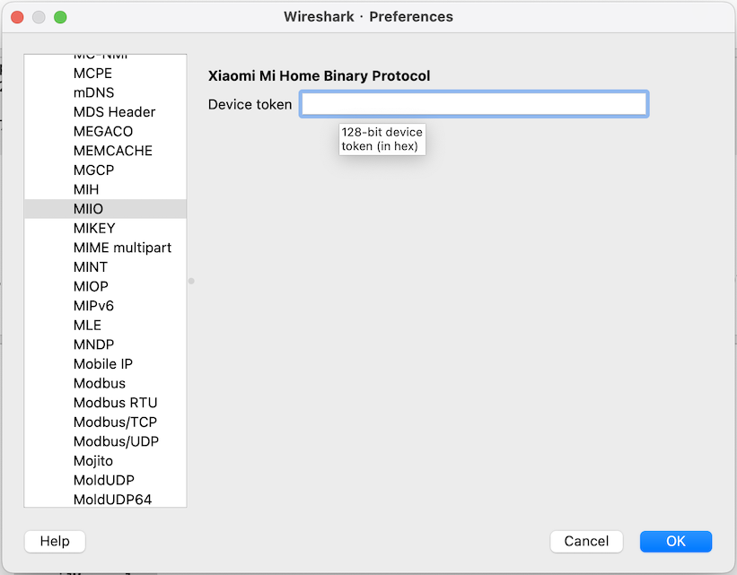

# miio-dissector
Xiaomi Mi Home Binary Protocol Dissector for Wireshark.

# Requirements

- macOS (Windows not available, Linux not tested)
- openssl installed

# Install

Copy the [miio.lua](https://raw.githubusercontent.com/0x5e/miio-dissector/main/miio.lua) file to `~/.config/wireshark/plugins/miio.lua`.

Or execute:
```shell
sh -c "$(curl -fsSL https://raw.githubusercontent.com/0x5e/miio-dissector/main/install.sh)"
```

# Usage
After installation, restart the Wireshark, open `Preferences` -> `Protocols` -> `MIIO` page, input the device token and save.



# Documentation
[Xiaomi's MiHome Binary protocol](https://github.com/OpenMiHome/mihome-binary-protocol/blob/master/doc/PROTOCOL.md)

[Wireshark’s Lua API Reference Manual](https://www.wireshark.org/docs/wsdg_html_chunked/wsluarm_modules.html)

[Lua编写Wireshark插件实战](https://www.zybuluo.com/natsumi/note/77991)
